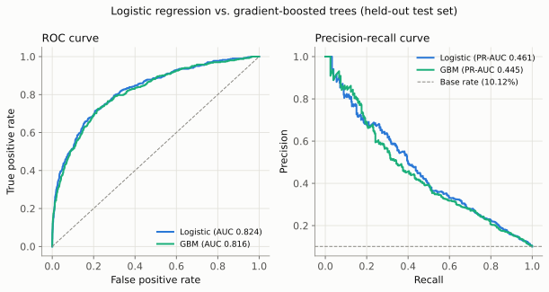
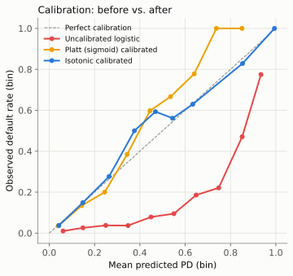
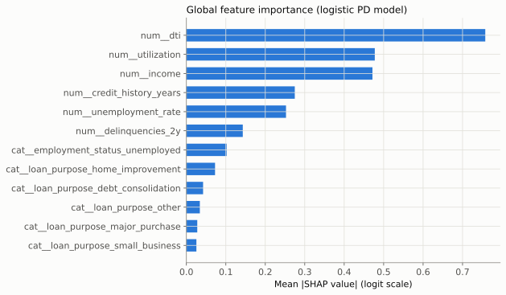
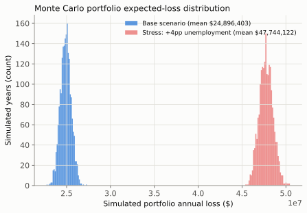

# Credit Risk Model

A probability-of-default (PD) model for consumer credit underwriting: a scaled,
class-weighted logistic regression scorecard, benchmarked against a
gradient-boosted tree, with post-hoc probability calibration, SHAP
explainability, segment-level performance checks, and a Monte Carlo
expected-loss simulation with a macro stress scenario.

## Motivation

A lender approving or declining loan applications needs two things from a risk
model that are often in tension: it has to *rank* applicants well (so the
riskiest are caught) and its output has to be a *trustworthy probability* (so a
10% predicted PD really does mean about 1 in 10 such borrowers default,
because that number feeds directly into pricing and loss-reserve decisions).
This project builds that pipeline end to end — data, model, calibration,
explainability, segment monitoring, and a portfolio loss simulation — the way
a credit risk team would evaluate whether a scorecard is fit for production.

## Data: synthetic, by necessity

No real labeled credit dataset (Lending Club, UCI German Credit, etc.) was
reachable in the build environment without manual, account-gated downloads. So
this project generates a synthetic borrower-level dataset from a documented,
nonlinear data-generating process (DGP) in
[`src/credit_risk_model/data.py`](src/credit_risk_model/data.py), and says so
plainly here: **every number in the Results section below comes from a real
run against synthetic data, not real borrowers.**

Each borrower has: `income`, `dti` (debt-to-income), `utilization` (credit
utilization), `credit_history_years`, `delinquencies_2y`, `unemployment_rate`
(a macro variable), `loan_purpose` (6-category segment), and
`employment_status`. The true default probability is a nonlinear function of
these features (quadratic DTI effects, a DTI x utilization interaction, an
unemployment x employment-status interaction) plus unobserved-heterogeneity
noise, passed through a logistic link and calibrated so the realized default
rate lands near a configurable target (10% here — defaults are the minority
class, as in real portfolios). See `_true_logit` in `data.py` for the exact
functional form and every coefficient.

**To swap in a real dataset**, build a CSV with the columns in
`credit_risk_model.data.FEATURE_COLUMNS` plus a binary `default` column, and
load it with `pandas.read_csv(...)` wherever `generate_borrowers(...)` is
called in `scripts/generate_report.py`. Continuous features should stay on
their natural raw scales (dollars, ratios in `[0, 1]`, years, counts) — the
pipeline's `ColumnTransformer` handles scaling and encoding itself.

## Methodology

1. **Split**: 60% train / 20% calibration / 20% test, stratified on the
   default label, so the calibration step is fit on data the base model never
   saw (avoiding the optimistic bias of calibrating on training data).
2. **Class imbalance**: defaults are ~10% of borrowers. The logistic
   regression uses `class_weight="balanced"`; the gradient-boosted baseline
   uses `sample_weight` from `sklearn.utils.class_weight.compute_sample_weight`.
   Both re-weight the loss rather than resampling the data, which keeps the
   full dataset available to both models.
3. **Primary model**: standard-scaled, one-hot-encoded logistic regression
   (`src/credit_risk_model/models.py`) — a scorecard-style linear model whose
   coefficients are directly interpretable on the logit scale.
4. **Baseline**: `HistGradientBoostingClassifier` on the same feature matrix,
   to quantify how much discrimination is given up (or not) for
   interpretability.
5. **Calibration**: both Platt scaling (`sigmoid`) and isotonic regression are
   fit on the held-out calibration split via
   `sklearn.calibration.CalibratedClassifierCV` wrapping a `FrozenEstimator`
   of the already-fitted logistic pipeline, so calibration never re-touches
   the training data.
6. **Explainability**: `shap.LinearExplainer` against the fitted logistic
   regression's coefficients in transformed feature space — closed-form and
   fast for a linear model, so there was no need to fall back to permutation
   importance (SHAP installed and ran cleanly and quickly in this
   environment).
7. **Expected loss**: LGD and EAD are not observed in this dataset (there's no
   recovery or loan-size history to fit them from), so both are assigned from
   documented assumed distributions conditioned on loan purpose as a stand-in
   for collateral/ticket size (see `src/credit_risk_model/expected_loss.py`
   for every assumed mean). A Monte Carlo simulation draws an independent
   default/LGD/EAD realization per borrower per simulated year (2,000
   simulated years) to produce a portfolio loss distribution, then repeats it
   under a stress scenario.

## Install & usage

```bash
git clone https://github.com/gilhermanns/credit-risk-model.git
cd credit-risk-model
python3 -m venv .venv && source .venv/bin/activate
pip install -r requirements.txt
pip install -e .
```

Run the full test suite:

```bash
pytest -q
```

Regenerate every chart and metric in this README from a fresh run:

```bash
python scripts/generate_report.py
```

Score a single applicant (the underwriting CLI — approve / refer / decline,
plus its top risk drivers):

```bash
credit-risk \
  --income 45000 --dti 0.42 --utilization 0.75 --credit-history-years 4 \
  --delinquencies-2y 2 --unemployment-rate 7.5 \
  --loan-purpose small_business --employment-status unemployed
```

```
Credit Risk Underwriting Decision
----------------------------------------
Raw model PD:        0.9650
Calibrated PD (isotonic): 0.8750
Decision cutoffs:    approve < 0.07 <= refer < 0.20 <= decline
Decision:            DECLINE

Top drivers (SHAP, logit scale, vs. baseline -0.5259):
  num__utilization                    +0.7905  (increases risk)
  cat__employment_status_unemployed   +0.7052  (increases risk)
  num__dti                            +0.6485  (increases risk)
  num__unemployment_rate              +0.5498  (increases risk)
  num__delinquencies_2y                +0.4486  (increases risk)
```

The CLI retrains the pipeline in-process against the fixed-seed synthetic
dataset (well under a second for logistic regression) rather than loading a
serialized model file, so it is fully reproducible from source with no binary
model artifacts to ship or go stale. Run `credit-risk --help` for every flag,
including the approve/decline threshold cutoffs.

## Results

All numbers below are from one real run of `scripts/generate_report.py`
(20,000 synthetic borrowers, seed 42, 12,000 train / 4,000 calibration / 4,000
test). Overall realized default rate: **10.13%**.

### Discrimination: logistic regression vs. gradient-boosted trees

| Model | ROC-AUC | PR-AUC | KS statistic |
|---|---|---|---|
| Logistic regression (primary) | 0.824 | 0.461 | 0.507 |
| HistGradientBoostingClassifier | 0.816 | 0.445 | 0.505 |

The interpretable linear model is not just competitive here — it edges out the
tree ensemble on every discrimination metric, since the DGP's nonlinear terms
(DTI-squared, a couple of interactions) are mild enough that a well-specified
linear scorecard captures most of the signal. A KS around 0.50 and AUC around
0.82 are in the range of a solid production-grade retail credit scorecard.



### Calibration: before vs. after

| Score | Brier score (test set) |
|---|---|
| Naive baseline (predict overall rate for everyone) | 0.0910 |
| Logistic regression, **uncalibrated** | 0.1738 |
| Logistic regression, **Platt (sigmoid) calibrated** | 0.0718 |
| Logistic regression, **isotonic calibrated** | 0.0713 |

The uncalibrated model's Brier score is *worse* than the naive baseline,
despite its much better ranking (AUC 0.824 vs. 0.5 for the baseline) — this is
the expected, well-known cost of `class_weight="balanced"`: it reweights the
loss to fix the model's ranking of the minority class, but as a side effect it
systematically over-predicts PD in raw probability terms. Calibrating on a
held-out split (never seen by the base model) fixes this: both calibration
methods roughly halve the Brier score relative to the naive baseline, and the
reliability diagram below shows the calibrated curves sitting much closer to
the diagonal than the raw scores.



### Confusion matrix at the underwriting cutoff (decline if calibrated PD ≥ 0.20)

| | Predicted approve | Predicted decline |
|---|---|---|
| **Actual good** | 3,349 (TN) | 246 (FP) |
| **Actual bad** | 217 (FN) | 188 (TP) |

At this cutoff: 10.85% of applicants are declined, 43.3% of declines are
correctly identified bad borrowers (precision), 46.4% of all bad borrowers are
caught (recall), and 6.8% of good borrowers are false-declined. The
approve/refer/decline CLI defaults to a lower "decline" cutoff (0.20) and a
separate "approve" cutoff (0.07), with everything in between routed to manual
review — see `credit-risk --help`.

### Explainability (SHAP, logistic model)

Global feature importance, mean absolute SHAP value on the logit scale, over
the test set:



Utilization, DTI, income, and being unemployed dominate — consistent with the
DGP by construction, which is itself a useful sanity check that the model
recovered the true structure rather than some spurious artifact of the
synthetic data.

### Segment-level performance (by loan purpose)

| Segment | n (test) | Observed default rate | Mean predicted PD | ROC-AUC | KS |
|---|---|---|---|---|---|
| small_business | 426 | 11.97% | 12.48% | 0.836 | 0.559 |
| debt_consolidation | 1,206 | 10.03% | 11.16% | 0.826 | 0.533 |
| credit_card | 883 | 10.08% | 9.69% | 0.797 | 0.461 |
| other | 475 | 9.47% | 8.78% | 0.828 | 0.477 |
| major_purchase | 449 | 10.02% | 9.42% | 0.849 | 0.553 |
| home_improvement | 561 | 9.63% | 8.84% | 0.805 | 0.473 |

Mean predicted PD tracks observed default rate closely in every segment (no
segment is off by more than ~1.1 points), and discrimination (KS 0.46-0.56)
holds up across all six loan purposes — the model isn't quietly failing on
any one segment.

### Expected loss: base case vs. stress scenario

LGD and EAD are assumed (documented in `expected_loss.py`): mean LGD ranges
from 35% (home improvement, treated as closer to secured) to 65% (small
business), and mean EAD is a purpose-specific base loan size plus 15% of
annual income. Monte Carlo over 2,000 simulated portfolio-years, resampling
default, LGD, and EAD independently each draw:

| Scenario | Analytic point estimate | MC mean | MC 95th pct. | MC 99th pct. |
|---|---|---|---|---|
| Base | $24.83M | $24.90M | $25.91M | $26.29M |
| Stress: +4pp unemployment | — | $47.74M | $49.05M | $49.62M |

The analytic point estimate (`sum(PD x LGD x EAD)`) and the Monte Carlo mean
agree to within 0.3%, as they should. The stress scenario re-scores every
borrower's PD with the model after shifting the macro `unemployment_rate`
feature up by 4 percentage points (roughly a recession-sized shock), holding
LGD/EAD assumptions fixed — portfolio expected loss **nearly doubles**, driven
by the DGP's built-in interaction between unemployment and being unemployed,
plus the macro term's direct effect on everyone else.



## Limitations & next steps

- **Synthetic data.** Every result here reflects the documented DGP, not real
  borrower behavior. Swapping in a real, schema-matched CSV (see the Data
  section) would be the highest-value next step to validate these results.
- **WOE/IV binning** for the logistic model (a classic credit-scorecard
  technique) was scoped as a nice-to-have and not implemented; the current
  model uses standard-scaled continuous features instead. Binning would trade
  some flexibility for even more interpretable, monotonic score bands.
- **LGD/EAD are assumed, not fitted** — a real deployment would estimate both
  from historical recovery and utilization-at-default data rather than
  documented priors.
- **No time dimension.** Real portfolios have vintage effects and
  origination-to-default lags; this dataset is a single cross-section.
- **Calibration drift over time** isn't modeled — in production, a scorecard's
  calibration should be periodically re-checked (a PSI/population stability
  check) rather than assumed static.
