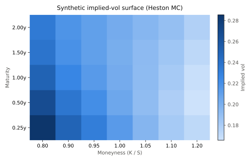
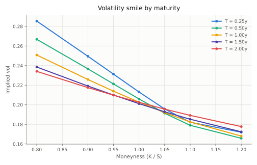
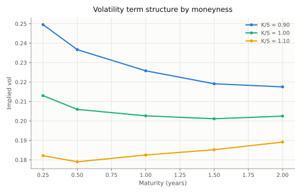
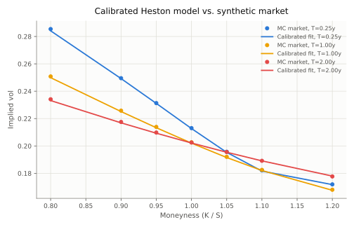

# Options Pricing & Volatility Lab

A from-scratch options pricing and volatility toolkit: closed-form, tree, and
simulation pricers cross-validated against each other; analytic and numerical
Greeks; a robust implied-volatility solver; and a Heston stochastic-volatility
model that is simulated, used to build a synthetic implied-vol surface, and
then re-calibrated back to that surface as a round-trip correctness check.

## Motivation

Anyone can call `scipy` and get a Black-Scholes price. The interesting
questions are whether independently-derived pricing methods actually agree
with each other, whether "the Greeks" computed in closed form match what you'd
get by bumping inputs and re-pricing, and whether a stochastic-volatility
model calibrated to a vol surface actually recovers parameters close to the
ones that generated the data — or whether the fit is quietly compensating
model misspecification with garbage parameters. This project answers those
questions with code and numbers rather than assertions, and does so without
depending on a live market-data feed (see **Data** below).

## Data

No live option-chain data source was available in the build environment. All
"market" data in this project is **synthetic**: an underlying is simulated
under a Heston stochastic-volatility model with parameters chosen up front,
a grid of European option prices is Monte Carlo estimated from those
simulated paths, and Black-Scholes implied vols are inverted from those
prices to form a smile/skew and term structure. This is a standard way to
demo and unit-test pricing/calibration code without a data vendor, and it has
one big advantage over real quotes: because the generating parameters are
known, calibration can be checked as a **round trip** (recovered vs. seeded
parameters) instead of trusting an unverifiable fit.

## Methodology

- **Pricers** (`options_vol_lab.pricers`): Black-Scholes closed form (calls
  and puts, continuous dividend yield); a Cox-Ross-Rubinstein binomial tree
  with an early-exercise check at every node (European or American); and a
  Monte Carlo pricer under GBM with antithetic variates and a control variate
  (the discounted terminal spot, whose risk-neutral mean is known
  analytically) for variance reduction.
- **Greeks** (`options_vol_lab.greeks`): closed-form delta/gamma/vega/theta/rho
  from the Black-Scholes formula, plus a pricer-agnostic central
  finite-difference implementation that works on any of the pricers above.
  The two are cross-checked against each other in the test suite.
- **Implied volatility** (`options_vol_lab.implied_vol`): Brent's method
  inverting the Black-Scholes price, with an intrinsic-value floor check and
  an explicit error when the target price isn't bracketed by the search
  bounds.
- **Heston model** (`options_vol_lab.heston`): a semi-closed-form pricer using
  the Fourier-inversion characteristic function with the Albrecher et al.
  "Little Heston Trap" formulation (numerically stable across maturities,
  unlike the original 1993 formula); an Euler/full-truncation path simulator
  (Lord, Koekkoek & van Dijk, 2010) used to generate the synthetic market
  surface by Monte Carlo; and a `scipy.optimize.least_squares` calibrator that
  fits the 5 Heston parameters (kappa, theta, sigma_v, rho, v0) to a target
  implied-vol grid using vega-weighted price residuals (a standard
  Jaeckel-style approximation to fitting in vol space without inverting the
  model price on every iteration).
- **Surface construction** (`options_vol_lab.surface`): for each maturity,
  simulate one batch of Heston terminal-spot draws, then reuse that batch to
  price every strike at that maturity and invert its implied vol.

## Install & usage

```bash
git clone https://github.com/gilhermanns/options-vol-lab.git
cd options-vol-lab
python3 -m venv .venv && source .venv/bin/activate
pip install -e .
pytest -q                      # run the test suite

# Price a single option and dump Greeks (analytic vs. finite-difference)
ovl-price --spot 100 --strike 105 --rate 0.03 --vol 0.22 --ttm 0.5 --type call

# Build the synthetic Heston vol surface, plot it, and calibrate back to it
python scripts/build_surface.py
```

## Results

### Single-option pricing and Greeks

`ovl-price --spot 100 --strike 105 --rate 0.03 --vol 0.22 --ttm 0.5 --type call --steps 500 --paths 200000 --seed 42`:

```
Black-Scholes:          4.735864
Binomial (CRR):         4.738740  (steps=500)
Monte Carlo:            4.751471  +/- 0.010649  (paths=200000)

Greek           Analytic     Finite Diff
delta           0.444555        0.444555
gamma           0.025397        0.025397
vega           27.936603       27.936602
theta          -7.337643       -7.337643
rho            19.859834       19.859834
```

All three pricers agree to within Monte Carlo noise, and analytic Greeks match
finite differences to 5-6 significant figures.

American early exercise is visible for a deep-in-the-money put
(`--spot 80 --strike 100 --rate 0.06 --vol 0.2 --ttm 1.0 --type put --american`):
the European (Black-Scholes) price is **16.20**, while the American binomial
price is **20.00** — exactly the intrinsic value, because immediate exercise
dominates for a deep ITM, long-dated put at a 6% rate.

### Volatility surface (synthetic Heston market)

Heston parameters used to generate the "market": `kappa=2.0, theta=0.045,
sigma_v=0.55, rho=-0.65, v0=0.05`, `spot=100, r=0.03`, priced by Monte Carlo
(200,000 paths per maturity) across 5 maturities x 7 strikes and inverted to
implied vol.







The skew is the expected shape for `rho < 0`: OTM puts / ITM calls (low
strikes) trade at materially higher implied vol than OTM calls, and the skew
flattens with maturity as the variance process mean-reverts toward `theta`.

### Heston calibration round trip

Calibrating the 5 Heston parameters back to the Monte Carlo surface above
(`scripts/build_surface.py`, real output):

```
Surface build time: 2.6s (5 maturities x 7 strikes, 200,000 MC paths each)
Calibration time: 2.7s, nfev=8, final cost=8.842901e-06

param           seeded      fitted    rel. error
kappa           2.0000      2.0873        4.36%
theta           0.0450      0.0443        1.66%
sigma_v         0.5500      0.5580        1.46%
rho            -0.6500     -0.6459        0.63%
v0              0.0500      0.0507        1.48%
```

All 5 parameters are recovered within ~4.4% of the values used to generate
the data, despite the target surface being built from noisy Monte Carlo
prices (not the exact closed-form price) — a genuine round-trip validation
rather than a fit to an already-smooth analytic surface.



### Test suite

```
42 passed in 6.34s
```

Covers: BS price vs. a known textbook value (Hull); put-call parity with and
without dividends; binomial and Monte Carlo convergence to Black-Scholes for
European options as steps/paths grow; American vs. European early-exercise
premium; analytic vs. finite-difference Greeks; implied-vol recovery of the
vol used to generate a price; Heston degenerating to Black-Scholes as
vol-of-vol vanishes; Heston put-call parity; Heston Monte Carlo matching the
semi-closed-form price; and Heston calibration recovering seeded parameters
from a noise-free target surface.

## Limitations & next steps

- The "market" surface is synthetic (see **Data**); no live option-chain
  feed was available in the build environment. The code is data-source
  agnostic — swapping in a real quote feed only requires replacing
  `build_synthetic_surface` with a loader that returns the same `VolSurface`
  shape.
- The Heston calibration objective is vega-weighted price residuals rather
  than a true nonlinear fit in implied-vol space (which would require an
  inner root-find on every outer iteration); this is a standard, much faster
  approximation but can slightly under-weight far-OTM points where vega is
  small.
- The binomial tree does not special-case dividend ex-dates (only a
  continuous yield); a discrete-dividend tree would be needed for
  single-name American equity options with known cash dividends.
- No jump component (Bates model) or local-vol overlay is included; the pure
  Heston skew flattens faster at long maturities than many real equity
  index surfaces do.
- The calibrator uses a single local optimizer run from one initial guess;
  a production calibration would use multi-start or a global optimizer to
  guard against local minima on noisier or sparser real surfaces.
