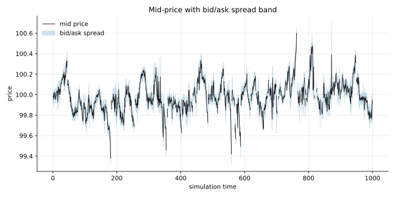
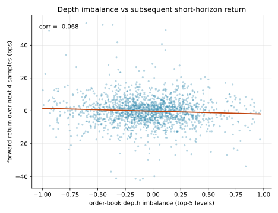
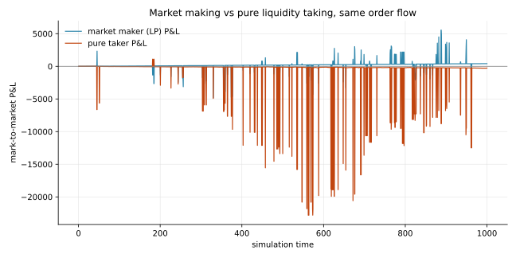
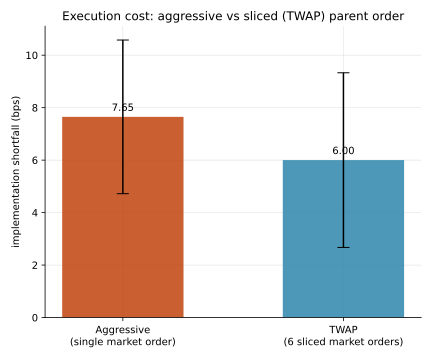
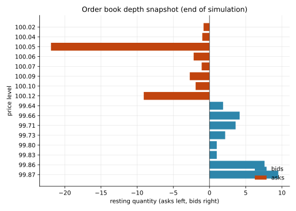

# Order Book Microstructure Simulator

An event-driven limit order book with price-time priority matching, populated by
three types of trading agents (liquidity provider, momentum, noise), used to study
how market structure — spreads, depth, and order flow — shapes execution outcomes.

## Research question

If a market only consists of a market maker quoting around fair value, momentum
traders chasing recent price moves, and noise traders submitting essentially
random orders, what emerges endogenously? Specifically: how does resting depth
imbalance relate to the next few ticks of price movement, does the market maker
actually get compensated for the adverse selection risk it takes on, and — the
practical question a trading desk cares about — is it cheaper to execute a large
order as one aggressive market sweep or as a sliced TWAP schedule, given the
market impact and depth replenishment that this order flow produces?

There is no external market data in this project. Every number in the Results
section below comes from running the simulator itself with a fixed random seed
(no calibration to or claims about any real venue).

## Methodology

**Order book.** `LimitOrderBook` (`src/orderbook_sim/orderbook.py`) keeps bids and
asks as `{price: deque[Order]}` with a `sortedcontainers.SortedList` of active
price levels per side. Same-price orders fill strictly FIFO. Limit orders that
cross the book match immediately (walking price levels as needed, with partial
fills); any unmatched residual rests on the book. Market orders match until
filled or the book runs out of liquidity, with any residual **dropped** rather
than resting (standard market-order semantics). Cancellation looks up the
resting `Order` object directly and removes it from its own deque/price level —
no lazy deletion, so depth and imbalance snapshots are always exact.

**Simulation engine.** `Engine` (`src/orderbook_sim/engine.py`) is a single
`heapq`-based event loop. Every agent (and a metrics sampler) is a "next event
time" generator: liquidity-provider requoting, momentum checks, and noise-trader
arrivals are independent Poisson processes (`t + Exponential(1/rate)`); a
one-shot or TWAP-sliced parent order instead carries a fixed schedule. The loop
pops the next event in time order, lets that actor act on the shared book, then
reschedules it — so all order flow interacts through one consistent, replayable
clock. A single `numpy.random.default_rng(seed)` drives every draw, so a given
seed reproduces an identical run bit-for-bit (see `test_deterministic_with_fixed_seed`).

**Agents** (`src/orderbook_sim/agents.py`):
- **Liquidity provider** — cancels and re-quotes both sides around the current
  mid at a fixed half-spread, shifted by `-inventory_skew * inventory` so it
  leans against its own position (skews quotes down when long, up when short).
- **Momentum trader** — compares the current mid to the mid from `lookback`
  time units ago; if the move exceeds a threshold, fires a market order in that
  direction.
- **Noise trader** — on each arrival, picks a random side, a random size, and
  (with `limit_prob` probability) posts a limit order at a random offset from
  mid, otherwise fires a market order.
- **Pure taker** — a benchmark agent that fires a random-direction market order
  on every arrival, used only for the P&L comparison against the market maker.
- **Parent order executor** — injects a single large order either as one
  aggressive market sweep or as `n` equal-sized slices at fixed intervals,
  alongside the ongoing background flow, to measure execution cost under
  realistic impact and replenishment.

**Metrics** (`src/orderbook_sim/metrics.py`): mid-price and spread time series,
top-of-book depth and imbalance, realized volatility from log-returns of the
sampled mid, fill rate by agent type (filled quantity / sent quantity), and
adverse selection — for every liquidity-provider fill, the difference between
the fill price and the mid price `horizon` time units later, signed so that a
positive number means the price moved against the position the LP was left
holding.

**Execution-cost experiment** (`src/orderbook_sim/execution.py`): for a given
seed, background order flow runs undisturbed until an entry time, at which
point a 60-unit parent buy order is executed either as one market sweep
(*aggressive*) or as 6 equal slices 2 time units apart (*TWAP*), while the same
background agents keep trading around it. Because both strategies reuse the
same seed and neither the background agents' scheduling nor their random draws
depend on market state, the two runs share bit-identical background order-flow
*timing and random draws* — they only diverge through the parent order's own
market impact. Implementation shortfall is the volume-weighted execution price
versus the mid price at the moment the parent order arrives, in basis points.

## Install & usage

```bash
python3 -m venv .venv && source .venv/bin/activate
pip install -e .
pip install -r requirements.txt   # pins exact versions used to produce the results below

pytest -q                         # run the test suite
python scripts/run_report.py      # regenerate reports/*.json and reports/*.svg
```

`scripts/run_report.py` runs one 1,000-time-unit background simulation and a
90-trial execution-cost experiment (15 seeds x 3 entry times x 2 strategies),
then writes `reports/summary.json`, `reports/shortfall_trials.json`, and the
five charts embedded below. Everything is deterministic given the seeds fixed
in `src/orderbook_sim/simulate.py`.

## Results

All numbers below are from an actual run (`seed=42`, `total_time=1000`,
1 liquidity provider, 3 momentum traders, 8 noise traders); see
`reports/summary.json` and `reports/shortfall_trials.json` for the raw output.

| Metric | Value |
|---|---|
| Trades executed | 11,317 |
| Average spread | 0.106 (median 0.100) |
| Realized volatility (per sqrt time unit) | 7.79e-4 |
| Average depth imbalance (top 5 levels) | -0.073 |
| Fill rate — LP / Momentum / Noise / Pure taker | 45.9% / 98.0% / 96.3% / 93.1% |
| Average adverse selection per LP fill | -0.041 (slightly favorable to the LP) |
| LP final P&L (final inventory -14.06) | +407.5 (std of P&L path: 624.9) |
| Pure-taker final P&L | -271.0 (std of P&L path: 3,185.8) |
| Execution shortfall — aggressive sweep | 7.65 bps (std 2.93, n=45) |
| Execution shortfall — TWAP (6 slices) | 6.00 bps (std 3.33, n=45) |
| Corr(depth imbalance, forward return over next 4 samples) | -0.068 |

The liquidity provider's lower fill rate reflects that only quotes actually
resting when the market moves through them get hit, versus momentum/noise
orders which are aggressive by construction and fill almost every time
liquidity exists. The market maker ends the run with a positive P&L and a
much smaller P&L standard deviation than the pure-taking benchmark under
*identical* background order flow — spread capture more than compensates for
the (slightly negative, i.e. favorable) adverse selection it measured here.
Slicing the parent order into a TWAP schedule reduced average implementation
shortfall by about 1.6 bps versus sweeping it all at once, consistent with
the intuition that a single aggressive order walks further down the book and
pays more market impact than the same volume spread over time (though with
overlapping std bands at only 45 trials per strategy — see Limitations). The
depth-imbalance-to-forward-return correlation in this run is weak and
slightly negative (-0.068) rather than the positive relationship often
reported in real markets — with a single, fast-requoting liquidity provider
dominating the touch, imbalance here is driven more by transient LP inventory
skew than by informed order flow, so it does not carry much predictive
signal in this particular agent population.

### Mid-price with spread band



### Depth imbalance vs. subsequent short-horizon return



### Market maker vs. pure-taker P&L, same order flow



### Execution cost: aggressive sweep vs. TWAP



### Order book depth snapshot (end of run)



## Limitations & next steps

- Agents are simple reactive rules, not optimizing strategies — there is no
  learning, no order-size optimization, and no explicit inventory limits on
  the momentum/noise agents.
- The execution-cost experiment uses 15 seeds x 3 entry times (45 trials per
  strategy); the shortfall standard deviations are wide enough that the point
  estimates should be read as directional, not as a tight confidence interval.
  More seeds/entry points would tighten this.
- There is a single instrument and a single liquidity provider; multi-LP
  competition, maker rebates/fees, and latency effects are not modeled.
- Depth-imbalance-to-return correlation is measured in-sample from the same
  run that generates it; it is a description of this simulated market's
  microstructure, not a claim about any real venue.
