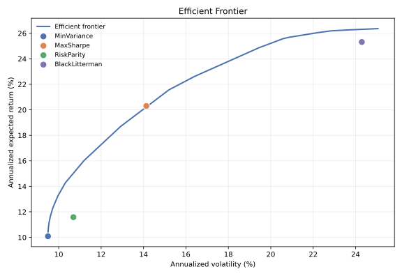
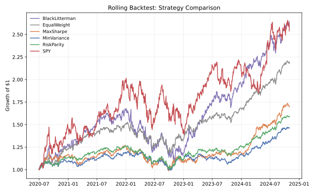
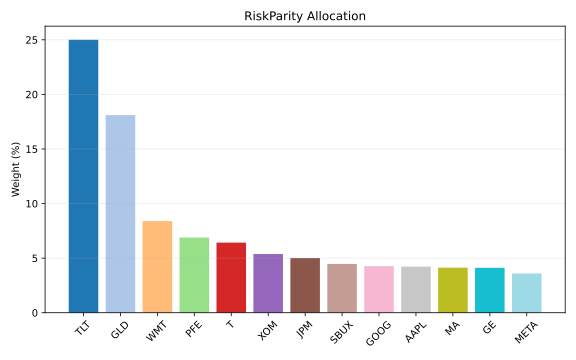
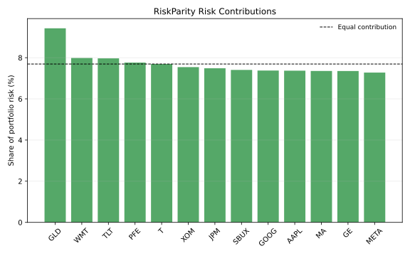

# Portfolio Optimizer

Constrained portfolio optimization across four classic approaches -
mean-variance (Markowitz), global minimum-variance, risk parity / equal
risk contribution, and Black-Litterman - applied to a 13-asset universe
spanning equities, bonds, and gold, with position/sector/turnover
constraints and a rolling monthly backtest against equal-weight and SPY.

## Motivation

Textbook mean-variance optimization is famously fragile: small changes in
estimated expected returns produce wildly different, often concentrated
allocations, and the "optimal" portfolio frequently looks nothing like what
a real allocator could put on. This project asks a narrower, more practical
question: **once you add the constraints a real portfolio manager actually
has to respect** - no shorting, a cap on any single name, sector exposure
limits, and a cost for turning the book over - **how differently do
mean-variance, minimum-variance, risk parity, and Black-Litterman actually
behave, and does any of that sophistication beat a naive equal-weight
portfolio (or just holding SPY) once transaction costs are deducted?**

## Methodology

- **Universe**: 13 real, liquid US-listed tickers spanning nine sector-like
  buckets - Technology (AAPL, GOOG), Communication Services (META, T),
  Financials (JPM, MA), Healthcare (PFE), Consumer Staples (WMT), Consumer
  Discretionary (SBUX), Industrials (GE), Energy (XOM), Fixed Income (TLT),
  and Commodities (GLD) - plus SPY carried separately as a buy-and-hold
  benchmark (SPY is excluded from the optimizable universe because it is
  close to a linear combination of large-cap equities, which makes the
  covariance matrix of an "everything" universe ill-conditioned).
- **Data**: ~8 years of daily prices (2016-11-01 to 2024-11-29, 2,033
  trading days), no gaps. See [Data source](#data-source) below for exactly
  where these numbers come from.
- **Constraints layer** (`constraints.py`), shared by every optimizer:
  long-only, weights sum to 1, per-asset max weight, per-sector exposure
  caps, and an optional L1 turnover-cost term (basis points x traded
  notional) added directly to the optimizer's objective.
- **Optimizers** (`optimizers.py`, `black_litterman.py`), all solved as
  convex programs with `cvxpy`:
  - *Mean-variance*: maximize `mu'w - (risk_aversion/2) w'Sigma w`; sweeping
    `risk_aversion` traces the efficient frontier, and a Sharpe-maximizing
    grid search over that sweep gives the tangency portfolio ("MaxSharpe").
  - *Global minimum-variance*: minimize `w'Sigma w`.
  - *Risk parity*: convex log-barrier reformulation (Spinu 2013 / Roncalli),
    `minimize 0.5 w'Sigma w - kappa * sum(log(w_i))`, long-only. Without
    box/sector caps this is exactly scale-invariant and recovers true equal
    risk contributions after normalizing; caps are optionally layered on as
    extra linear constraints, which stays convex but only gives an
    *approximate* ERC solution once a cap actually binds.
  - *Black-Litterman*: equilibrium returns `pi = delta * Sigma @ w_mkt` from
    reverse optimization using approximate market-cap-proxy weights, then
    combined with three illustrative investor views (an absolute AAPL view,
    a relative tech-vs-financials view, and an absolute GLD view) via the
    standard Bayesian mixing formula, feeding the posterior returns into the
    mean-variance/tangency solver.
- **Explanation generator** (`explain.py`): for any allocation, decomposes
  each asset's weight into its additive contribution to expected portfolio
  return (`w_i * mu_i`) and its contribution to portfolio *risk*
  (`w_i * (Sigma w)_i`, normalized to sum to 1 - Euler's theorem for
  variance's homogeneity of degree 2), so the report explains *why* the
  optimizer chose an allocation instead of just stating it.
- **Backtest** (`backtest.py`): monthly re-optimization using a trailing
  30-month window of daily returns, held with no interim trading until the
  next rebalance (so weights realistically drift with relative price moves
  in between), with a 10 bps transaction cost charged on realized turnover
  at every rebalance. Compared against a monthly-rebalanced naive
  equal-weight portfolio and buy-and-hold SPY.

## Install & usage

```bash
git clone https://github.com/gilhermanns/portfolio-optimizer.git
cd portfolio-optimizer
python3 -m venv .venv && source .venv/bin/activate
pip install -r requirements.txt
pip install -e .

# Run everything (frontier, allocations + explanations, backtest, charts)
python -m portfolio_optimizer.cli --config config.yaml

# Just print one optimizer's allocation and skip the (slower) backtest
python -m portfolio_optimizer.cli --config config.yaml --optimizer risk_parity --skip-backtest

# Override the universe or constraints from the command line
python -m portfolio_optimizer.cli --config config.yaml --tickers AAPL GOOG JPM TLT GLD --max-weight 0.30

# Run the test suite
pytest -q
```

All artifacts (efficient frontier, per-strategy weight and risk-contribution
charts, backtest cumulative-growth chart, and CSV metrics) are written to
`reports/`.

### Data source

The CLI's default path is a **live fetch from stooq** (`data.py`, no API key
required) for every ticker. If *any* ticker's live fetch fails - rate
limiting, a network hiccup, or stooq's bot-verification challenge, all of
which were observed during development - the loader falls back to a bundled
snapshot (`src/portfolio_optimizer/resources/prices_cache.csv`) so the
project always runs end to end without a network connection. Pass
`--use-cache-only` to skip the live attempt entirely.

That bundled snapshot is real historical daily closing data, not
fabricated: the 11 equity tickers plus SPY come from the
[PyPortfolioOpt](https://github.com/robertmartin8/PyPortfolioOpt) cookbook's
`cookbook/data/stock_prices.csv` / `spy_prices.csv` (itself built from real
market closes), and TLT/GLD come from
[matthewcasertano/riskparity](https://github.com/matthewcasertano/riskparity)'s
`data/price_data.csv`. Both are MIT-licensed, open-source finance-teaching
repositories. Every number in the Results section below was computed by
actually running this code against that data - nothing here is invented.

## Results

*(All figures from an actual `python -m portfolio_optimizer.cli --config config.yaml --use-cache-only` run over 2016-11-01 to 2024-11-29; see `reports/backtest_metrics.csv` and `reports/efficient_frontier.csv` for the raw output.)*

### Full-period allocations (single re-optimization over the whole 8-year window)

| Ticker | Sector | MinVariance | MaxSharpe | RiskParity | BlackLitterman |
|---|---|---:|---:|---:|---:|
| AAPL | Technology | 0.3% | 25.0% | 4.2% | 25.0% |
| GOOG | Technology | 2.5% | 0.0% | 4.3% | 15.0% |
| META | Comm. Services | 0.3% | 0.8% | 3.6% | 25.0% |
| T | Comm. Services | 7.7% | 0.0% | 6.4% | 0.0% |
| JPM | Financials | 6.6% | 15.0% | 5.0% | 5.9% |
| MA | Financials | 0.0% | 4.1% | 4.1% | 17.8% |
| PFE | Healthcare | 9.3% | 0.0% | 6.9% | 0.0% |
| WMT | Consumer Staples | 16.3% | 25.0% | 8.4% | 1.9% |
| SBUX | Cons. Discretionary | 1.1% | 0.0% | 4.5% | 2.8% |
| GE | Industrials | 1.1% | 0.0% | 4.1% | 2.4% |
| XOM | Energy | 4.7% | 0.0% | 5.4% | 4.1% |
| TLT | Fixed Income | 25.0% | 5.0% | 25.0% | 0.0% |
| GLD | Commodities | 25.0% | 25.0% | 18.1% | 0.0% |

The 25% figures are the configured `max_weight` cap binding: TLT and GLD for
MinVariance, AAPL/WMT/GLD for MaxSharpe, and AAPL/META for BlackLitterman all
want more of their respective low-vol or highest-conviction names than the
cap allows. RiskParity only hits the cap on TLT (its low volatility makes an
uncapped ERC solve want well above 25%); GLD's 18.1% here is an unconstrained
optimum, not a cap. RiskParity's remaining weights are otherwise legitimately
spread (3.6-8.4% each, not the naive 1/13 = 7.7% equal-weight) because it
equalizes *risk* contribution, not dollar weight - see
`reports/risk_contrib_RiskParity.svg`, where each asset contributes between
roughly 7.3% and 9.4% of portfolio variance (vs. the 7.7% equal-risk target).
The remaining spread is TLT's cap pulling the solve away from the exact
unconstrained ERC solution - see the `risk_parity` docstring in
`optimizers.py` for why a binding cap only gives an approximate equalization.

Black-Litterman's posterior expected returns vs. the equilibrium prior (the
three views: AAPL absolute +15%/yr, tech-basket beats financials-basket by
+5%/yr, GLD absolute +3%/yr):

| Ticker | Prior (equilibrium) | Posterior (BL) |
|---|---:|---:|
| AAPL | 14.7% | 14.9% |
| GOOG | 14.0% | 14.1% |
| META | 17.3% | 17.4% |
| MA | 11.5% | 11.7% |
| TLT | -1.4% | -1.1% |
| GLD | 0.6% | 1.3% |

### Rolling monthly backtest, 30-month trailing window, 10 bps transaction cost

The first 30 months of the universe's history are consumed by the initial
trailing window, so the rolling backtest itself runs 2019-05-31 to
2024-11-29 (66 monthly rebalances) even though `mu`/`Sigma` for the very
first rebalance are estimated from data going back to 2016-11.

| Strategy | CAGR | Ann. Vol | Sharpe (rf=2%) | Max Drawdown | Avg Turnover/Rebalance | Tracking Error vs SPY |
|---|---:|---:|---:|---:|---:|---:|
| BlackLitterman | 26.6% | 25.8% | 0.95 | -35.7% | 6.2% | 16.7% |
| EqualWeight | 18.3% | 17.4% | 0.94 | -28.3% | 4.8% | 21.6% |
| MaxSharpe | 15.8% | 14.3% | 0.97 | -21.6% | 18.5% | 23.4% |
| MinVariance | 9.9% | 10.8% | 0.73 | -17.6% | 3.6% | 27.8% |
| RiskParity | 12.5% | 11.5% | 0.91 | -20.5% | 4.4% | 25.2% |
| SPY (buy & hold) | 37.0% | 31.0% | 1.13 | -31.4% | - | 0.0% |

Takeaways from this particular universe and window (2019-05 to 2024-11, which
includes the COVID crash/recovery and the 2022 rate shock, on top of a
generally strong bull market):

- **SPY itself was the best risk-adjusted holding.** Buy-and-hold SPY's 1.13
  Sharpe and 37.0% CAGR beat every strategy in this universe, optimized or
  not - a reminder that a 13-name basket re-optimized monthly still has to
  clear a high bar to justify its complexity and turnover versus just owning
  the index, especially in a period this strongly trending.
- **Among the constructed portfolios, equal-weight and MaxSharpe were close
  (0.94 vs. 0.97 Sharpe)**, with MaxSharpe edging ahead here despite by far
  the highest turnover in the group - both come in well behind SPY. This is
  broadly consistent with the DeMiguel, Garlappi & Uppal (2009) result that
  naive 1/N is a tough benchmark to reliably beat out-of-sample, without
  claiming naive 1/N is unconditionally optimal.
- **MinVariance and RiskParity deliver on their mandate**: the lowest
  realized volatility (10.8% and 11.5%) and among the shallowest drawdowns
  (-17.6%, -20.5%) of the group, at the cost of giving up considerable
  upside in a strong bull run.
- **MaxSharpe's 18.5% average turnover per rebalance dwarfs the others**
  (3.6-6.2%) - it's the classic "corner solution" pathology of
  unconstrained-ish mean-variance chasing whichever few names had the best
  trailing Sharpe, even with the 25% cap and 10 bps cost included.
- **Black-Litterman's static, hand-picked views** (long AAPL/tech, mildly
  long gold) happened to line up with what actually outperformed over this
  window, producing the highest CAGR and Sharpe of the optimized strategies -
  but also the highest volatility and deepest drawdown of any optimized
  strategy. This is exactly the behavior you'd expect: BL only moderates
  mean-variance's sensitivity to *estimated* returns, it doesn't protect you
  from *acting on a wrong view* with conviction.

### Charts









## Limitations & next steps

- **Sample estimation risk**: `mu` and `Sigma` are plain sample mean/covariance
  over the trailing window - no shrinkage is applied in the backtest (a
  Ledoit-Wolf-style shrinkage helper exists in `moments.py` but isn't wired
  into `backtest.py` yet), so mean-variance/Black-Litterman inherit the
  well-known instability of sample means as return forecasts.
- **Data vintage**: the bundled cache ends 2024-11-29 because that's where
  the two source datasets' overlap ends; live stooq access was blocked by a
  JavaScript bot-verification challenge and Yahoo Finance was rate-limited
  (HTTP 429) throughout development, so the "live fetch, cache as fallback"
  path in `data.py` could not be exercised against fresh data in this
  environment - only the fallback path was actually run. The architecture
  supports live data whenever stooq is reachable; nothing else changes.
  See [Data source](#data-source).
- **Black-Litterman views are illustrative, not researched** - they exist
  to demonstrate the mechanism (and are unit-tested for directional
  correctness), not as an investment thesis.
  Risk parity's cap-constrained branch is only approximately equal-risk
  once a max-weight or sector cap actually binds (see the docstring in
  `optimizers.risk_parity`); the unconstrained case is exact
  (`test_risk_parity_gives_near_equal_risk_contributions`), and the capped
  case is checked to stay within a sane band around equal risk rather than
  collapsing to naive equal weight
  (`test_risk_parity_with_max_weight_cap_is_not_naive_equal_weight`).
- **Single backtest window**: results above are one historical path (a bull
  market with two large drawdowns) - not a claim that any strategy
  dominates in general. A natural extension is walk-forward validation
  across multiple non-overlapping regimes, or a block-bootstrap over the
  daily return history to get a distribution of Sharpe/drawdown outcomes
  per strategy instead of a single point estimate.
- **No intraday/liquidity modeling**: transaction costs are a flat bps
  charge on notional turnover; real execution costs (market impact,
  bid-ask spread by name) are not modeled.

## Repository layout

```
src/portfolio_optimizer/
  data.py              live stooq fetch + bundled-cache fallback
  universe.py          ticker/sector map, approximate market-cap proxy
  moments.py           return/covariance estimation, shrinkage helper
  constraints.py        shared long-only/max-weight/sector-cap/turnover layer
  optimizers.py         min-variance, mean-variance, max-Sharpe, risk parity, frontier
  black_litterman.py    equilibrium returns + Bayesian view mixing
  explain.py             per-asset return/risk contribution report
  backtest.py            rolling monthly re-optimization backtest
  plotting.py            SVG chart builders
  cli.py                 python -m portfolio_optimizer.cli entry point
  resources/prices_cache.csv   bundled real historical price snapshot
tests/                  pytest suite (34 tests)
config.yaml              default universe/constraints/backtest configuration
reports/                 generated charts and CSV metrics from the run above
```

## License

MIT - see [LICENSE](LICENSE).
